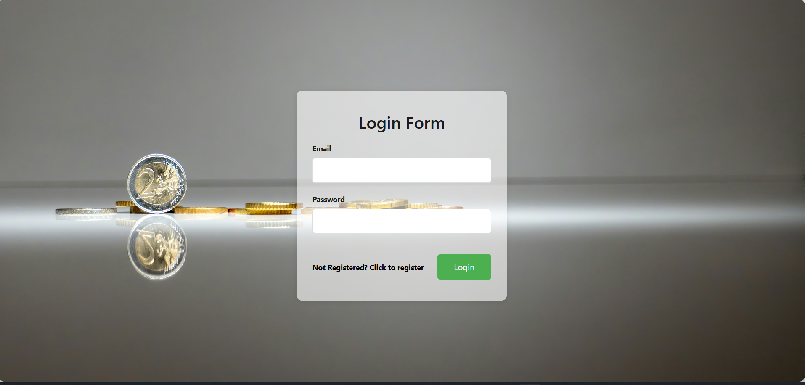
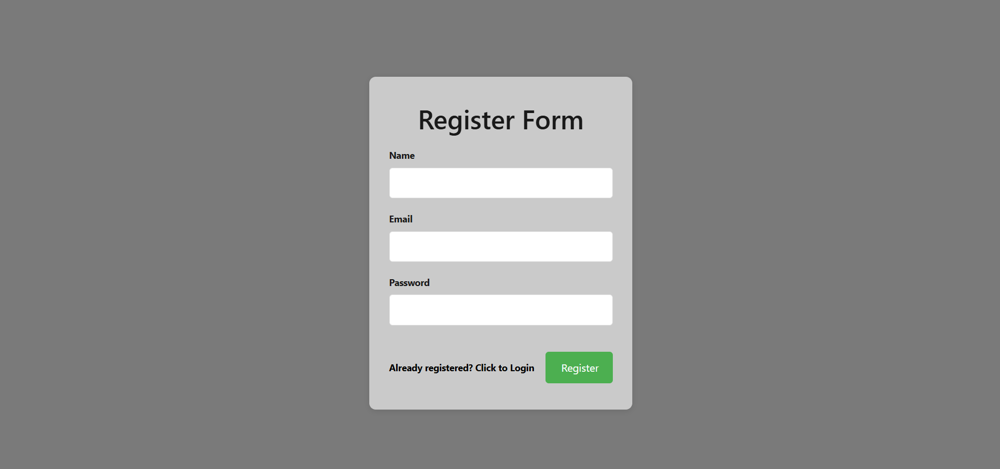

# Expense Tracker App

A full-stack expense tracking application with React frontend and Node.js/Express backend, using a RESTful API and MongoDB for data persistence.

## 🚀 Features

* **User Authentication**: Register, login, logout
* **Transactions**: Add, update, and delete transactions
* **Filters & Reports**: List transactions by date range

## 📂 Repository Structure

```
Expense-Tracker/
├─ client/                  # React frontend
│  ├─ public/               # Static assets
│  ├─ src/
│  │  ├─ components/        # UI components (Layout, Analytics, Spinner)
│  │  ├─ pages/             # Pages (HomePage, Login, Register)
│  │  ├─ App.js             # Root component
│  │  ├─ index.js           # Entry point
│  │  └─ index.css          # Global styles
│  └─ package.json
|
├─ server/                  # Express backend
│  ├─ config/               # Database & JWT configuration
│  ├─ controllers/          # Route handlers
│  ├─ models/               # Mongoose schemas
│  ├─ routes/               # API routes
|  |_ server.js
│  ├─ .env                  # Backend environment variables
│  └─ package.json
└─ README.md                # Project overview and setup
```

## 🔧 Installation

### Prerequisites

* Node.js v14+
* npm 
* MongoDB running locally 

### 1. Clone the repository

```bash
git clone https://github.com/khadka-123/Expense-Tracker-App.git
cd Expense-Tracker-App
```

### 2. Install dependencies

#### Backend

```bash
cd server
npm install
```

#### Frontend

```bash
cd client
npm install
```

## ⚙️ Configuration

### Backend (`server/.env`)

```env
PORT=4000
MONGO_URL=mongodb://localhost:27017/expense-tracker
```

## 📦 Running the Application

### Start MongoDB

Ensure your MongoDB instance is running (e.g., `mongod`).

### Backend Server

```bash
cd server
npm run dev   # starts with nodemon
```

### Frontend Client

```bash
cd client
npm start     # opens http://localhost:3000
```

## 🤝 Contributing

1. Fork the repository
2. Create a branch 
3. Commit your changes 
4. Push to branch 
5. Open a Pull Request

## 🖼️ Project Screenshot





## 📜 License
© 2025 Khadka Baniya
